# PRD — frappe-stack

> Product Requirements Document. Owns the *what* and *why*. Pairs with `PLAN.md` (the *how*) and `SECURITY.md` (the *must-not*).

## 1. Problem

Building Frappe apps today requires a developer for every change. PMs, analysts, and business analysts have to:

- File a ticket, wait for a developer to add a DocType / Custom Field / Workflow.
- Trust that the developer remembered fixtures (so the change ships with the app).
- Trust that permissions, audit log, and site-vs-app-fixture conflicts were handled.

This forces non-developers into manual workarounds (spreadsheets, paper forms, off-platform approvals). Meanwhile, even when developers do the work, **site changes routinely drift from GitHub** — the audit trail is the change log of a single site, not git history.

## 2. Users & their jobs

### Primary: PM / Analyst (non-developer)

> "I need to add a beneficiary registration form with three approval levels and a dashboard. I don't want to write Python."

Jobs:
- Create DocTypes, Custom Fields, Workflows, Dashboards, Reports, Configs.
- See what they built committed to GitHub automatically.
- Promote staging changes to production with confidence (review + approval).
- Run A/B experiments on workflows to compare approval paths.

### Secondary: Developer / DevOps

Jobs:
- Review PM-generated PRs before merge to production.
- Trust that the plugin already enforced security/best-practice — review = sanity check, not full audit.
- Diff site state vs git state when troubleshooting.

### Tertiary: Director / Compliance

Jobs:
- Audit every change via git history + Frappe's built-in Activity Log + the local `.frappe-stack/audit.jsonl` on PM machines.
- Confirm no PII bypass, no `ignore_permissions=True`, no hard deletes.

## 3. Solution shape

### 3.1 One layer

**The Claude Code plugin (`frappe-stack`)** — slash commands, skills, agents, safety hooks. PM types intent; plugin generates correct config and POSTs it to Frappe's stock REST API. Nothing custom-installed on the Frappe site (D-10 confirmed 2026-05-05).

The plugin still includes the four `Experiment Assignment`, A/B Custom Field, and Server Script primitives — but those are **created on demand via stock `POST /api/resource`**, the first time you run `/frappe-stack:experiment define`. They are normal Frappe DocTypes / Custom Fields / Server Scripts, not a custom Frappe app.

### 3.2 Sync model — B+ hybrid (D-01 confirmed)

```mermaid
%%{init: {
  'theme': 'base',
  'themeVariables': {
    'primaryColor': '#F5E6DD',
    'primaryTextColor': '#2E2E2E',
    'primaryBorderColor': '#8B1E24',
    'lineColor': '#9E2A2F',
    'secondaryColor': '#E7C1AD',
    'tertiaryColor': '#ffffff',
    'fontFamily': 'Inter, system-ui, sans-serif',
    'fontSize': '13px'
  }
}}%%
flowchart LR
    PM["PM types in<br>Claude Code"]
    Build[/frappe-stack:build/]
    Stage[("Staging site<br>stock Frappe v15+")]
    Pull[/frappe-stack:pull/]
    Repo[("GitHub config repo<br>versioned JSON<br>per blueprint")]
    Promote[/frappe-stack:promote/]
    PR{"PR review<br>merge"}
    CI[Operator CI runs<br>bench migrate]
    Prod[("Production site<br>git-only")]

    PM --> Build
    Build -->|"POST /api/resource/&lt;DocType&gt;"| Stage
    Stage --> Pull
    Pull -->|"per-blueprint JSONs"| Repo
    Repo --> Promote
    Promote --> PR
    PR --> CI
    CI --> Prod

    classDef cmd fill:#F5E6DD,stroke:#8B1E24,stroke-width:1.5px,color:#2E2E2E,rx:10,ry:10
    classDef store fill:#ffffff,stroke:#8B1E24,stroke-width:1.5px,color:#2E2E2E
    classDef gate fill:#F28C38,stroke:#9E2A2F,stroke-width:1.5px,color:#ffffff
    classDef plain fill:#ffffff,stroke:#D9B3A0,stroke-width:1px,color:#6B6B6B
    class Build,Pull,Promote cmd
    class Stage,Repo,Prod store
    class PR gate
    class PM,CI plain
```

- Staging is the playground — fast iteration via stock REST.
- Production is git-only — the audit trail *is* git history.
- `/frappe-stack:promote` is the bridge: snapshots staging via stock REST, writes per-blueprint JSONs to the config repo, opens a PR, lets a reviewer approve, merges, triggers prod migrate via the operator's existing CI/CD.

### 3.3 A/B experiments in workflows

A **split state** in Frappe Workflow with deterministic traffic assignment by `hash(experiment_id || doc.name)`. Implemented as stock primitives — Custom Field on the target DocType, Server Script on workflow state-change, regular `Experiment Assignment` DocType for tracking. Created by `/frappe-stack:experiment define` via `POST /api/resource/...`. Promotable via `/frappe-stack:experiment promote arm_a`, which strips the losing arm from the workflow JSON and opens a PR.

Full spec in `PLAN.md §8`.

## 4. Non-goals

- Replacing Frappe's Form Builder UI. We *call* it.
- Cross-Frappe-version magic. We target **Frappe v15+** only.
- Multi-tenant federation. One plugin install = one stack of (staging, prod) sites.
- Generic workflow engine. Only Frappe Workflow extensions.

## 5. Success metrics (post-MVP)

| Metric | Target |
|---|---|
| Time from PM intent → DocType live on staging | < 5 minutes |
| % of site changes reflected in git within 1 commit | 100% (enforced — non-negotiable) |
| % of PR-promoted changes that pass `frappe-semgrep-rules` | 100% (block at hook) |
| `ignore_permissions=True` instances introduced via plugin | 0 (block at hook) |
| `allow_guest=True` instances introduced via plugin | 0 (block at hook) |

## 6. Out of scope for v0.1

- `infra/` (Docker compose, CI workflows, pre-commit) — deferred per stakeholder direction.
- Mobile/Flutter integration (`frappe-mobile-sdk` already exists separately).
- Print format builder (Frappe core handles this).
- Multi-language UI (Frappe `__()` is enough for now).

## 7. Inspiration & prior art

- [`sunandan89/mgrant-frappe-patterns`](https://github.com/sunandan89/mgrant-frappe-patterns) — patterns catalog to absorb into our `frappe-patterns` skill (when public).
- [`dhwani-ris/frappe_dhwani_base`](https://github.com/dhwani-ris/frappe_dhwani_base) — ruff/eslint/prettier/pyupgrade pre-commit + Frappe Semgrep + pip-audit setup, when we get to `infra/`.
- [`gavindsouza/awesome-frappe`](https://github.com/gavindsouza/awesome-frappe) — survey before building anything new.
- The structural pattern (Claude Code plugin shipping skills/agents/commands/hooks for a Frappe codebase) was adapted from an internal reference that informs the layout and naming conventions used here.
