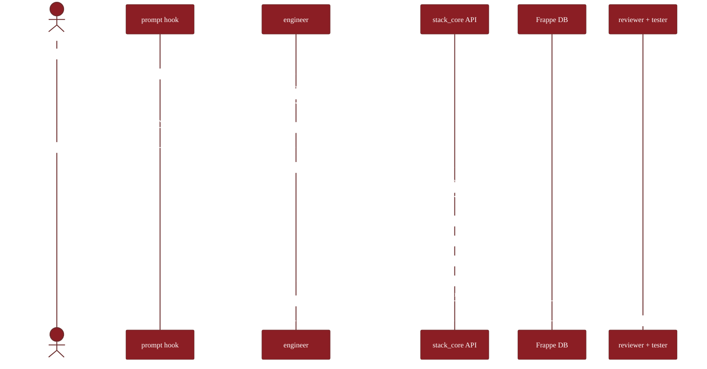
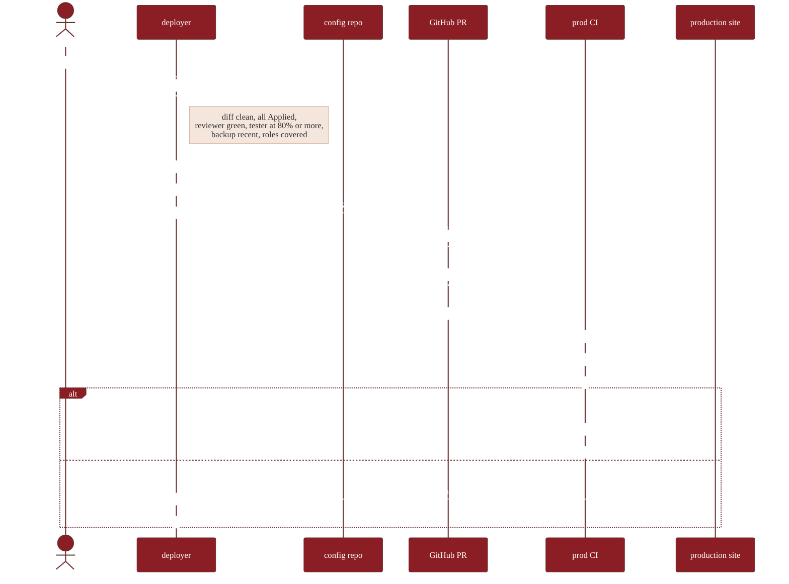

# Architecture

How the plugin, the support app, and your GitHub repository fit together.

## Three actors

-   :material-laptop:{ .lg .middle } **1 · Claude Code on your machine**

    ---

    The plugin lives here. Slash commands launch the engineer agent, which loads the right skill for your ask. Hooks run before each tool call to keep things safe.

    - Slash commands: `/frappe-stack:*`
    - Skills loaded by `engineer`
    - Hooks: prompt · pre-tool · post-tool · stop
    - Local audit log: `.frappe-stack/audit.jsonl`

-   :material-database-outline:{ .lg .middle } **2 · Frappe site + `stack_core`**

    ---

    Your staging site runs the small support app. Every API call is permission-checked, validated against guardrails, and audit-logged. The git-bridge module exports state on demand.

    - DocTypes: Stack Blueprint, Workflow Def, Experiment Assignment, Audit Log
    - API: `stack_core.api.*`
    - Guardrails: schema · fieldtype · reserved-name · workflow · permission
    - git_bridge: exporter · committer · pr_opener · differ · applier

-   :material-source-repository:{ .lg .middle } **3 · GitHub config repository**

    ---

    Your single source of truth for production. Each blueprint is a JSON file. Production only accepts changes via pull requests — `bench migrate` runs on merge.

    - `fixtures/app/doctypes/*.json`
    - `fixtures/app/workflows/*.json`
    - `fixtures/site/<sitename>/overrides.json`
    - `main` protected → CI runs `bench migrate` on prod

The arrows: **Claude Code → Frappe site** (HTTPS + API key, staging only). **Frappe site ↔ GitHub** (pull / push fixtures via the git-bridge). **GitHub → production** (PR merge triggers `bench migrate`).

## The B+ hybrid sync model

| Site role | Direction | Allowed |
|---|---|---|
| **Staging** | Site → git via `/pull` | ✓ |
| **Staging** | git → site via `/push` | ✓ |
| **Production** | Site → git (read-only export) | ✓ |
| **Production** | git → site via `bench migrate` (on PR merge) | ✓ |
| **Production** | direct API write | ✗ blocked by `is_production=1` |

`/promote` is the bridge: snapshot staging → PR against config-repo `main` → review → merge → CI migrates prod.

## End-to-end build flow

## End-to-end promote flow

## DocType layout (`stack_core`)

The four DocTypes the support app installs:

| DocType | Holds | Notable |
|---|---|---|
| **Stack Blueprint** | Versioned JSON config — DocType, Workflow, Dashboard, Report, Custom Field, Property Setter | `status` flips Draft → Validating → Applied. `git_commit_sha` set on `/push`. |
| **Stack Workflow Def** | Workflow definition + experiment metadata | Validates states, transitions, traffic split sums to 100. Optional `experiment_id` enables A/B. |
| **Experiment Assignment** | One row per A/B-tracked document | Append-only. Hard-delete blocked. Records `arm`, `outcome`, `cycle_time_seconds`. |
| **Stack Audit Log** | Every API mutation + actor + timestamp + before/after JSON | Append-only. Hard-delete blocked. `permission_query` restricts non-admins to their own rows. |

## Layered enforcement

The same rule appears at multiple layers — defense in depth.

| Concern | Plugin layer | API layer | DB layer | CI layer |
|---|---|---|---|---|
| Reserved DocType name | UserPromptSubmit nudge | `guardrails/reserved_names.py` | n/a | n/a |
| Fieldtype whitelist | n/a | `guardrails/fieldtype_whitelist.py` (role-gated) | n/a | n/a |
| `ignore_permissions=True` | UserPromptSubmit nudge | PreToolUse `block_ignore_permissions.py` | refused if blueprint requests it | semgrep |
| Direct prod API write | UserPromptSubmit nudge | PreToolUse `block_direct_prod_api.py` | `permission_enforcer.refuse_on_production` | n/a |
| Hard delete on audit-tagged | n/a | n/a | `before_delete` + DocType `on_trash` | n/a |
| f-string SQL | n/a | PreToolUse `block_fstring_sql.py` | n/a | semgrep + frappe-semgrep-rules |
| Force-push to protected | UserPromptSubmit nudge | PreToolUse `block_dangerous_bash.py` | n/a | GitHub branch protection |
| Real PII in prompt | UserPromptSubmit block | n/a | n/a | n/a |

## Local audit + remote audit

Two audit trails, deliberately:

- **`.frappe-stack/audit.jsonl`** (local) — every tool call (Bash / Edit / Write) by the PM in their session. Independent of network. Useful when the site is unreachable.
- **`Stack Audit Log` DocType** (remote, on the site) — every API call and blueprint mutation, with actor, IP, before / after. Append-only, queryable from the desk.

Both are durable. Disagreement between them is itself diagnostic — the `analyst` agent can surface the gap on demand.

## Failure modes the system handles

| Failure | What happens |
|---|---|
| `gh` CLI not installed | `pr_opener.py` falls back to GitHub REST API |
| GitHub token absent | `pr_opener.py` raises a clear error; operator configures it |
| Working tree dirty before promote | `committer.py` refuses; surfaces existing changes |
| Network down during commit | Commits locally; push retries |
| Schema migration fails on prod | CI auto-restores backup, reverts merge, pages on-call |
| Token leaked | Operator runs the rotate-keys runbook; old token invalidated |
| Blueprint validation fails on apply | `Stack Blueprint.status = Failed` with `validation_errors` set |
| Drift detected daily | `applier.reconcile_drift` logs an Error Log entry |

See [`SECURITY.md §5`](../SECURITY.md#5-incident-response) for the formal incident protocol.
