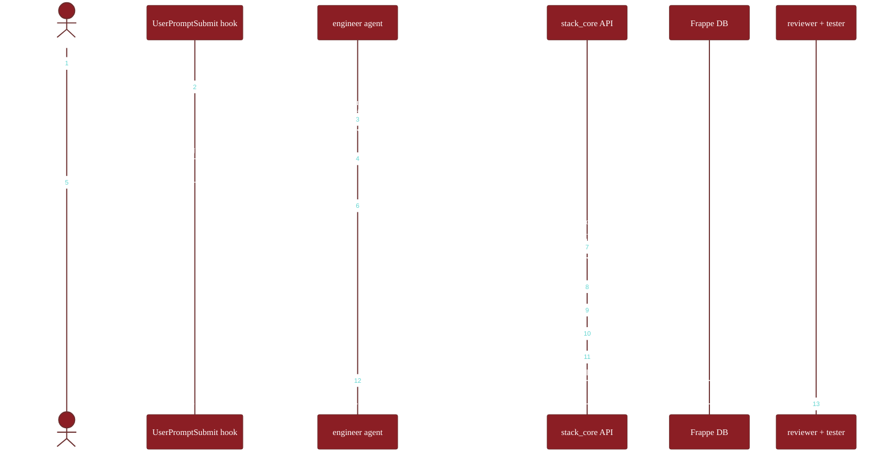
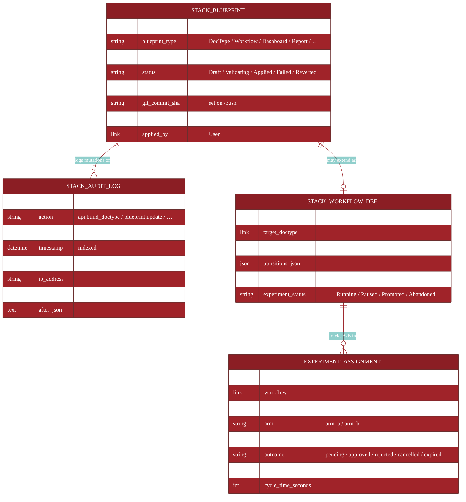

# Architecture

How the plugin, the support app, and the GitHub config repo flow together.

## The three actors

```mermaid
%%{init: {
  'theme': 'base',
  'themeVariables': {
    'primaryColor': '#8B1E24',
    'primaryTextColor': '#ffffff',
    'primaryBorderColor': '#6A2E2E',
    'lineColor': '#9E2A2F',
    'secondaryColor': '#F5E6DD',
    'tertiaryColor': '#E7C1AD',
    'background': '#F5E6DD',
    'fontFamily': 'Inter, system-ui, sans-serif'
  }
}}%%
flowchart LR
    subgraph PM["1 · Claude Code (PM's machine)"]
        direction TB
        P1["Slash commands<br/>/frappe-stack:*"]
        P2["Skills loaded by<br/>engineer agent"]
        P3["Hooks: UserPromptSubmit /<br/>PreToolUse / PostToolUse / Stop"]
        P4["Local audit log<br/>.frappe-stack/audit.jsonl"]
    end

    subgraph SITE["2 · Frappe site (staging) + stack_core"]
        direction TB
        S1["DocTypes<br/>Stack Blueprint, Workflow Def,<br/>Experiment Assignment, Audit Log"]
        S2["API<br/>/api/method/stack_core.api.*"]
        S3["Guardrails<br/>schema, fieldtype, reserved_names,<br/>workflow, permission_enforcer"]
        S4["git_bridge<br/>exporter, committer, pr_opener,<br/>differ, applier"]
    end

    subgraph GIT["3 · GitHub config repo"]
        direction TB
        G1["fixtures/app/doctypes/*.json"]
        G2["fixtures/app/workflows/*.json"]
        G3["fixtures/app/{custom_fields,<br/>property_setters}.json"]
        G4["fixtures/site/&lt;sitename&gt;/<br/>overrides.json"]
        G5["main protected<br/>→ CI runs bench migrate on prod"]
    end

    PM ==>|"HTTPS + API key"| SITE
    SITE ==>|"pull / push fixtures"| GIT
    GIT ==>|"PR merge → bench migrate"| SITE

    classDef actorBox fill:#F5E6DD,stroke:#8B1E24,stroke-width:2px,color:#2E2E2E
    classDef itemBox fill:#ffffff,stroke:#D9B3A0,stroke-width:1px,color:#2E2E2E
    class PM,SITE,GIT actorBox
    class P1,P2,P3,P4,S1,S2,S3,S4,G1,G2,G3,G4,G5 itemBox
```



## The B+ hybrid sync model (D-01 confirmed)

| Site role | Direction | Allowed |
|---|---|---|
| **Staging** | Site → git via `/pull` | ✓ |
| **Staging** | git → site via `/push` | ✓ |
| **Production** | Site → git (read-only export) | ✓ |
| **Production** | git → site via `bench migrate` (on PR merge) | ✓ |
| **Production** | direct API write | ✗ blocked by `is_production=1` |

`/promote` is the bridge: snapshot staging → PR against config-repo `main` → review → merge → CI migrates prod.

## End-to-end build flow



## End-to-end promote flow

```mermaid
%%{init: {
  'theme': 'base',
  'themeVariables': {
    'primaryColor': '#8B1E24',
    'primaryTextColor': '#ffffff',
    'primaryBorderColor': '#6A2E2E',
    'lineColor': '#9E2A2F',
    'secondaryColor': '#F5E6DD',
    'actorBkg': '#8B1E24',
    'actorTextColor': '#ffffff',
    'actorLineColor': '#6A2E2E',
    'noteBkgColor': '#F5E6DD',
    'noteTextColor': '#2E2E2E',
    'noteBorderColor': '#D9B3A0',
    'fontFamily': 'Inter, system-ui, sans-serif'
  }
}}%%
sequenceDiagram
    autonumber
    actor PM
    participant Dep as deployer agent
    participant Repo as config repo
    participant GH as GitHub PR
    participant Reviewer
    participant CI as prod CI
    participant Prod as Frappe (prod)

    PM->>Dep: /frappe-stack:promote
    Dep->>Dep: pre-promote checklist:<br/>diff clean · all Applied · reviewer green ·<br/>tester ≥80% · backup &lt;24h · roles covered ·<br/>not Friday-after-14:00
    Dep->>Repo: exporter writes per-blueprint JSONs
    Dep->>Repo: committer creates branch + commits
    Dep->>GH: pr_opener (gh CLI / REST fallback)
    GH-->>Reviewer: tag rotation
    Reviewer->>GH: review + approve
    GH->>CI: merge to main → trigger
    CI->>Prod: bench --site prod backup
    CI->>Prod: bench --site prod migrate (idempotent)
    CI->>Prod: bench --site prod restart
    alt migrate fails
        CI->>Prod: restore backup
        CI->>GH: revert merge + page on-call
    else migrate succeeds
        Dep->>Prod: smoke-test changed surface
        Dep-->>PM: ✓ done · /frappe-stack:ship v0.X.0
    end
```

## DocType layout (`stack_core`)



`Stack Audit Log` is append-only. Hard delete is blocked by an `on_trash` hook plus a `before_delete` doc event registered on `*` in `hooks.py`. `permission_query` exposes only own-rows to `Stack Author`; full table to `System Manager` and `Stack Admin`.

## Layered enforcement

The same rule appears at multiple layers — defense in depth.

| Concern | Plugin layer | API layer | DB layer | CI layer |
|---|---|---|---|---|
| Reserved DocType name | UserPromptSubmit nudge | `guardrails/reserved_names.py` | n/a | n/a |
| Fieldtype whitelist | n/a | `guardrails/fieldtype_whitelist.py` (role-gated) | n/a | n/a |
| `ignore_permissions=True` | UserPromptSubmit nudge | PreToolUse `block_ignore_permissions.py` | refused if blueprint requests it | semgrep |
| Direct prod API write | UserPromptSubmit nudge | PreToolUse `block_direct_prod_api.py` | `permission_enforcer.refuse_on_production` | n/a |
| Hard delete on audit-tagged | n/a | n/a | `before_delete` + DocType `on_trash` | n/a |
| f-string SQL | n/a | PreToolUse `block_fstring_sql.py` | n/a | semgrep + frappe-semgrep-rules |
| Force-push to protected | UserPromptSubmit nudge | PreToolUse `block_dangerous_bash.py` | n/a | GitHub branch protection |
| Real PII in prompt | UserPromptSubmit block | n/a | n/a | n/a |

## Local audit + remote audit

Two audit trails, deliberately:

- **`.frappe-stack/audit.jsonl`** (local) — every tool call (Bash / Edit / Write) by the PM in their session. Independent of network. Useful when the site is unreachable.
- **`Stack Audit Log` DocType** (remote, on the site) — every API call, every blueprint mutation, with actor + IP + before / after. Append-only, queryable from desk.

Both are durable and inspectable. Disagreement between them is itself diagnostic — surfaced by the `analyst` agent on demand.

## Failure modes the system handles

| Failure | What happens |
|---|---|
| `gh` CLI not installed | `pr_opener.py` falls back to GitHub REST API |
| GitHub token absent | `pr_opener.py` raises clear error; operator must configure |
| Working tree dirty before promote | `committer.py` refuses; surfaces existing changes |
| Network down during commit | Commits locally; push fails; can be retried later |
| Schema migration fails on prod | CI auto-restores backup + reverts merge + pages on-call |
| Token leaked | Operator runs the rotate-keys runbook; old token invalidated immediately |
| Blueprint validation fails on apply | Stack Blueprint marked `status=Failed` with `validation_errors` set |
| Drift detected daily | `applier.reconcile_drift` logs an Error Log entry |

See [`SECURITY.md §5`](../SECURITY.md#5-incident-response) for the formal incident protocol.
