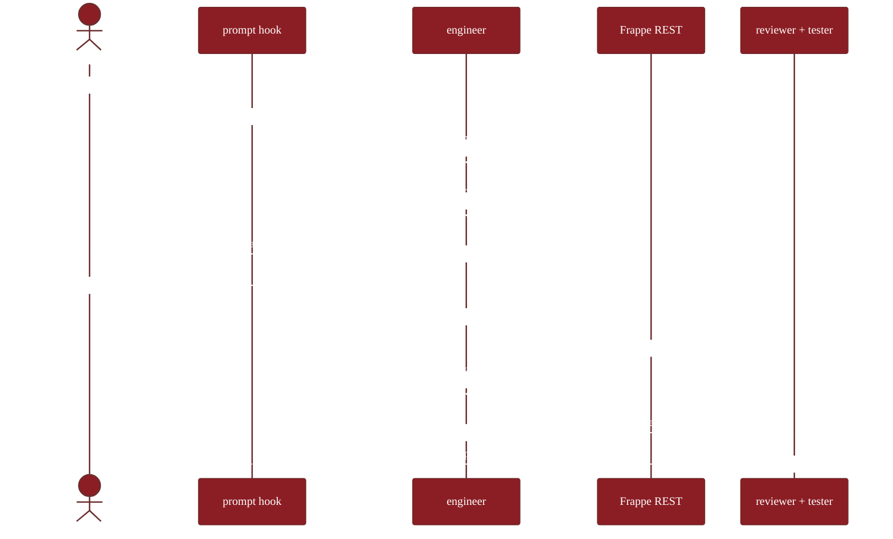
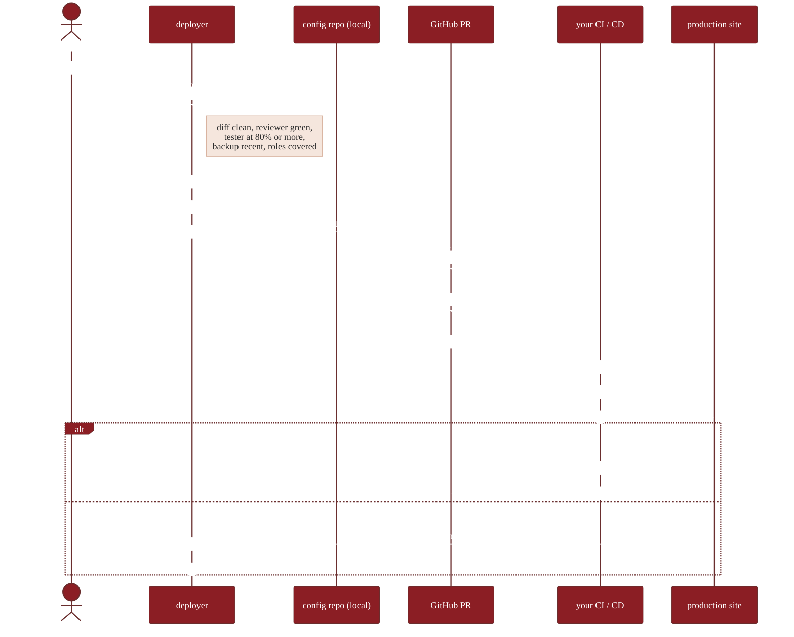

# Architecture

How the plugin, your Frappe site, and your GitHub repository fit together.

## Two actors and a sync layer

-   :material-laptop:{ .lg .middle } **1 · Claude Code on your machine**

    ---

    The plugin lives here — skills, agents, slash commands, and safety hooks. The engineer agent loads the right skill for your ask. Hooks run before each tool call to keep things safe.

    - Slash commands: `/frappe-stack:*`
    - Skills loaded by `engineer`
    - Hooks: prompt · pre-tool · post-tool · stop
    - Local audit log: `.frappe-stack/audit.jsonl`
    - Git operations run from your local config-repo checkout

-   :material-database-outline:{ .lg .middle } **2 · Stock Frappe v15+ site**

    ---

    The plugin authenticates with an API key + secret and uses Frappe's built-in REST endpoints. Nothing custom is installed on the site.

    - `POST /api/resource/DocType` — create / update DocTypes
    - `POST /api/resource/Workflow` — create workflows
    - `POST /api/resource/Custom Field` — add fields
    - `POST /api/resource/Property Setter` — change properties
    - Frappe's built-in Activity Log records every mutation server-side

-   :material-source-repository:{ .lg .middle } **3 · GitHub config repository**

    ---

    Your single source of truth for production. Each blueprint is a JSON file in `fixtures/`. Production only accepts changes via pull requests — your CI runs `bench migrate` on merge.

    - `fixtures/app/doctypes/*.json`
    - `fixtures/app/workflows/*.json`
    - `fixtures/site/<sitename>/overrides.json`
    - `main` branch protected

The arrows: **Claude Code → Frappe site** (HTTPS + token auth, staging only). **Claude Code → GitHub** (your local checkout, plus `gh` CLI / REST API for PR creation). **GitHub → production site** (your existing CI/CD runs `bench migrate` on PR merge — same pattern as any Frappe deployment).

## The B+ hybrid sync model

| Site role | Direction | Allowed |
|---|---|---|
| **Staging** | Site → git via `/pull` | ✓ |
| **Staging** | git → site via `/push` | ✓ |
| **Production** | Site → git (read-only export) | ✓ |
| **Production** | git → site via `bench migrate` (on PR merge) | ✓ |
| **Production** | direct API write from the plugin | ✗ blocked by hook (host marked `is_production` in `.frappe-stack/config.json`) |

`/promote` is the bridge: snapshot staging → PR against config-repo `main` → review → merge → CI migrates prod.

## End-to-end build flow

## End-to-end promote flow

## Where things live

| Concept | Where it actually lives |
|---|---|
| Blueprint (the JSON for a DocType / Workflow / etc.) | A JSON file in your GitHub config repo, plus the live record on your Frappe site |
| Plugin actions audit | `.frappe-stack/audit.jsonl` on your machine — every Bash / Edit / Write the plugin issued |
| Frappe-side audit | Frappe's built-in Activity Log on the site — every doc creation / edit, captured automatically |
| A/B experiment assignment | A small DocType the plugin creates on your site when you run your first `/frappe-stack:experiment define`. Just a normal DocType — nothing custom-installed. |
| Versioning | `git log` on your config repo. No separate "blueprint version" field. |
| Production state | The result of the most recent `bench migrate` on prod — driven by your CI from the config-repo `main` branch. |

## Layered enforcement

The same rule appears at multiple layers — defense in depth. All enforcement happens in the plugin (your machine) since there's nothing custom-installed on Frappe.

| Concern | Plugin layer | CI layer |
|---|---|---|
| Reserved DocType name | UserPromptSubmit nudge + skill refusal | n/a |
| Fieldtype whitelist | Skill refusal (Code/Password/Attach gated to elevated role) | n/a |
| `ignore_permissions=True` | UserPromptSubmit nudge + PreToolUse `block_ignore_permissions.py` | semgrep on the config repo |
| Direct prod API write | UserPromptSubmit nudge + PreToolUse `block_direct_prod_api.py` | n/a |
| f-string SQL | PreToolUse `block_fstring_sql.py` | semgrep + frappe-semgrep-rules |
| Force-push to protected | UserPromptSubmit nudge + PreToolUse `block_dangerous_bash.py` | GitHub branch protection |
| Real PII in prompt | UserPromptSubmit block | n/a |

## Failure modes the system handles

| Failure | What happens |
|---|---|
| `gh` CLI not installed | The deployer falls back to GitHub REST API |
| GitHub token absent | Deployer raises a clear error; user provides token via `/frappe-stack:init` |
| Working tree dirty before promote | The deployer refuses; surfaces existing changes |
| Network down during commit | Commits locally; push retries |
| Schema migration fails on prod | Your CI auto-restores backup, reverts merge, pages on-call |
| Token leaked | Operator runs the rotate-keys runbook; old token invalidated |
| API call rejected by Frappe permissions | Plugin surfaces the 403 to the user with the missing-role detail |

See [`SECURITY.md §5`](../SECURITY.md#5-incident-response) for the formal incident protocol.
