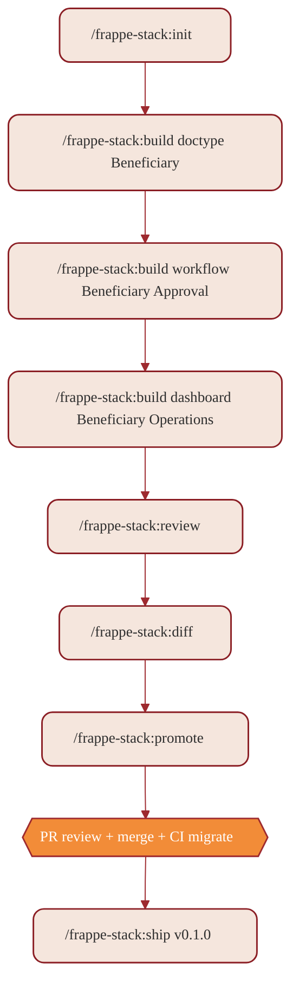

# Slash commands catalog

9 slash commands. PM-facing surface of the plugin. All invoked as `/frappe-stack:<command>`.

| Command | What it does | Refuses on |
|---|---|---|
| [`/frappe-stack:init`](../commands/init.md) | Configure the plugin to talk to your Frappe site: store API key/secret in OS keychain, register staging and production sites, point at your local config-repo checkout. Idempotent. | Frappe < v15, adding `--prod` before staging is configured |
| [`/frappe-stack:build`](../commands/build.md) | Build a DocType / Workflow / Dashboard / Report / Custom Field / Property Setter via the engineer agent. | `is_production=1`, reserved names, elevated fieldtypes without role, workflows without terminal state |
| [`/frappe-stack:pull`](../commands/pull.md) | Site → git: write per-blueprint JSONs to the config-repo working tree. No commit by default. | Working tree conflicts, network error, unconfigured `config_repo_local_path` |
| [`/frappe-stack:push`](../commands/push.md) | Git → site (staging only). Idempotent. | `--site=prod` (always refused), uncommitted working tree, blueprint guardrail failure |
| [`/frappe-stack:diff`](../commands/diff.md) | 3-bucket structured diff: only-on-site / only-in-git / changed. Refuses to auto-resolve. | Unconfigured `config_repo_local_path`, dirty working tree |
| [`/frappe-stack:promote`](../commands/promote.md) | Staging → prod via PR. Runs the pre-promote checklist; opens PR; watches merge → migrate. | Any checklist box failed (without `--emergency`), Friday-after-14:00 without `--emergency`, >5 unrelated blueprints |
| [`/frappe-stack:experiment`](../commands/experiment.md) | A/B in workflows: define / status / pause / resume / promote / abandon. | Promote with arm < 100 assignments, promote when CI crosses 0, define on a target without an existing workflow |
| [`/frappe-stack:review`](../commands/review.md) | Standalone reviewer + tester run. Does not mutate or open PRs. | No changes to review |
| [`/frappe-stack:ship`](../commands/ship.md) | Tag a release after a successful prod migrate. Updates CHANGELOG. | Last promote not successful, dirty working tree, version not strictly greater than last tag |
| [`/frappe-stack:rollback`](../commands/rollback.md) | Rewind staging to a previous config-repo commit via stock REST. Idempotent. | `--site=prod` (production rolls back through reverting the merge), dirty working tree, audit-tagged resources being deleted, expired DeployControl token |

## Typical flow



## Commands grouped by purpose

| Purpose | Commands |
|---|---|
| Setup | `init` |
| Build | `build`, `experiment` |
| Sync | `pull`, `push`, `diff` |
| Review & ship | `review`, `promote`, `ship` |

## Argument hints

Each command's `.md` declares an `argument-hint` that Claude Code shows when the user types `/frappe-stack:build ` (with a trailing space). The hints are short — they nudge correct usage without becoming documentation.

| Command | argument-hint |
|---|---|
| `init` | `<site-url> [--prod]` |
| `build` | `<type> <name> [--from-spec=<path>]` |
| `pull` | `[--site=staging\|prod] [--commit] [--push]` |
| `push` | `[--site=staging] [--dry-run]` |
| `diff` | `[--site=staging\|prod]` |
| `promote` | `[--emergency]` |
| `experiment` | `<action> [args]` |
| `review` | `[--blueprint=<name>] [--since=<git-ref>]` |
| `ship` | `<version> [--notes-from=<pr-number>]` |

## Adding a command

1. Create `commands/<name>.md` with frontmatter:
   ```yaml
   ---
   description: <what it does, one sentence>
   argument-hint: <example invocation>
   ---
   ```
2. Body: what it does, arguments, refuses-if, examples.
3. Add a row to this catalog.
4. If it spawns an agent, link to the agent's `.md`.
5. If it has refusals, mirror them into [`docs/hooks.md`](./hooks.md) so the hook layer enforces them too.
