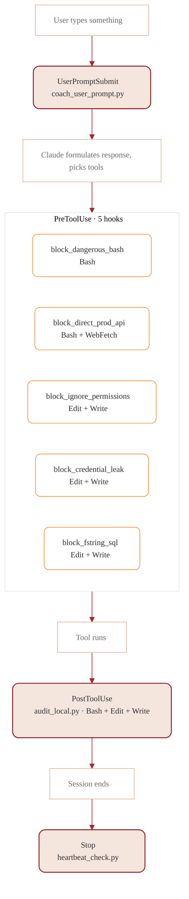

# Hooks catalog

8 hooks across 4 lifecycle events. All declared in [`hooks/hooks.json`](../hooks/hooks.json); scripts under [`.claude-plugin/hook_scripts/`](../.claude-plugin/hook_scripts/).

## Lifecycle layout



## UserPromptSubmit (1)

| Script | Refuses on | Coaches on |
|---|---|---|
| [`coach_user_prompt.py`](../.claude-plugin/hook_scripts/coach_user_prompt.py) | Real Aadhaar (12-digit) / PAN / Indian mobile in prompt; `DROP TABLE` / `TRUNCATE`; force-merge / bypass-review intent; `git push --force` to protected branches | Vague build intents (suggests slash command); production-write intents (redirects to `/promote`); permission-bypass language; elevated fieldtype mentions; schema renames; A/B intents without a question; multi-blueprint features without a spec; integration setups |

Reference doc: [`skills/process/prompt-coaching/SKILL.md`](../skills/process/prompt-coaching/SKILL.md).

## PreToolUse (5)

| Matcher | Script | Refuses on |
|---|---|---|
| `Bash` | [`block_dangerous_bash.py`](../.claude-plugin/hook_scripts/block_dangerous_bash.py) | `rm -rf /`, `rm -rf *`, `bench drop-site`, `git push --force` to `main`/`master`/`develop`/`release/*`, `DROP TABLE`/`DROP DATABASE`, `DELETE FROM` without `WHERE`, `curl … | sh` |
| `WebFetch\|Bash` | [`block_direct_prod_api.py`](../.claude-plugin/hook_scripts/block_direct_prod_api.py) | Mutating call to a host flagged `is_production=1` in `.frappe-stack/config.json` |
| `Edit\|Write` | [`block_ignore_permissions.py`](../.claude-plugin/hook_scripts/block_ignore_permissions.py) | `ignore_permissions=True`, `allow_guest=True`, `if frappe.session.user == "..."`, `if "..." in frappe.get_roles(...)` (hardcoded role checks) |
| `Edit\|Write` | [`block_credential_leak.py`](../.claude-plugin/hook_scripts/block_credential_leak.py) | AWS access keys (AKIA*), GitHub tokens, private key blocks, hardcoded `password=`/`api_key=`/`secret=`/`token=` literals, `Authorization: Bearer <literal>` |
| `Edit\|Write` (Python) | [`block_fstring_sql.py`](../.claude-plugin/hook_scripts/block_fstring_sql.py) | `frappe.db.sql(f"…SELECT…")`, `frappe.db.sql("…").format(…)`, `frappe.db.sql("…%s…") % (…)`, f-strings with SQL keywords |

## PostToolUse (1)

| Matcher | Script | Action |
|---|---|---|
| `Bash\|Edit\|Write` | [`audit_local.py`](../.claude-plugin/hook_scripts/audit_local.py) | Append a JSONL row to `.frappe-stack/audit.jsonl` per tool call. Independent of the on-site Stack Audit Log; this is the local-side trail. |

## Stop (1)

| Script | Action |
|---|---|
| [`heartbeat_check.py`](../.claude-plugin/hook_scripts/heartbeat_check.py) | If `PLAN.md` changed in the session but `HEARTBEAT.md` didn't, prompt the user to stamp it before ending the session. |

## Decision schema (all hooks)

Every hook script reads JSON from stdin, writes JSON to stdout. Schema:

```json
// approve unchanged
{}

// inject context (UserPromptSubmit only)
{"hookSpecificOutput": {"hookEventName": "UserPromptSubmit", "additionalContext": "..."}}

// block with reason
{"decision": "block", "reason": "..."}
```

Exit code 0 always (the JSON carries the decision). Exit code 2 indicates a blocking error.

## Bypass behavior

Hooks **cannot be bypassed by the user** through the CLI. They run inside Claude Code's tool dispatch. The only way to disable one is to edit `hooks/hooks.json` and remove the entry — and that change is captured by `audit_local.py` and visible in git.

## Adding a hook

1. Pick the lifecycle event (`UserPromptSubmit` / `PreToolUse` / `PostToolUse` / `Stop`).
2. Write the script under `.claude-plugin/hook_scripts/<name>.py`. Read stdin, write stdout JSON.
3. Add the entry to `hooks/hooks.json` under the right top-level key. Use a `matcher` for tool-specific events.
4. Add a regression test under `tests/hooks/` (TODO — not yet scaffolded).
5. Document in this catalog.
6. Open a PR with a `[hook]` label so security review is mandatory.

## Layered enforcement (cross-reference)

The same guardrail often appears at multiple layers:

| Guardrail | UserPromptSubmit | PreToolUse | Frappe REST | CI / PR |
|---|---|---|---|---|
| `ignore_permissions=True` | nudge | block | (refuses if blueprint requests it) | semgrep |
| `allow_guest=True` | nudge | block | n/a | semgrep |
| f-string SQL | n/a | block (Python) | n/a | semgrep |
| Direct prod API write | nudge ("redirect to /promote") | block (Bash + WebFetch) | refuse if `is_production=1` | n/a |
| PII in prompt | block | n/a | n/a | n/a |
| Hard-delete on audit-tagged | n/a | n/a | refuse on `before_delete` | n/a |
| Force-push to protected | nudge | block | n/a | branch protection |
| Real credential in code | n/a | block | n/a | secret scanner |

Defense in depth — if one layer slips, the next catches.
