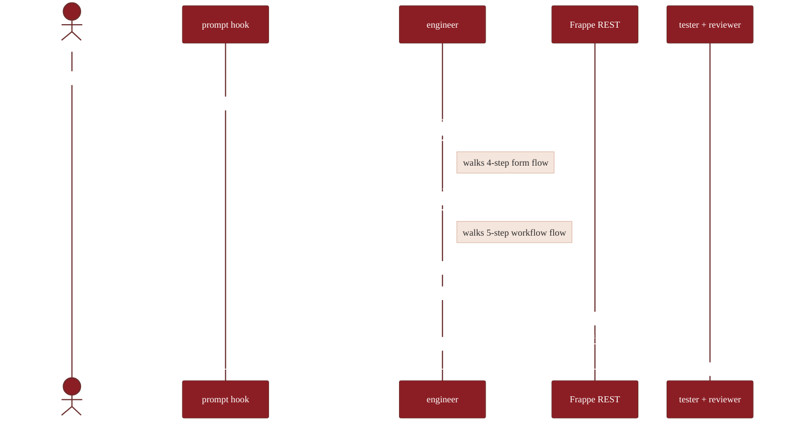

# Skills catalog

17 skills, organized by what a PM is trying to do. Each skill is a `SKILL.md` with frontmatter that tells Claude when to load it.

> PMs don't read these directly. The engineer agent loads them automatically based on the user's prompt + the active slash command. This catalog is for reviewers who want to audit what's available.

## Building things (6)

| Skill | Trigger phrases | Purpose | Refuses |
|---|---|---|---|
| [`building/designing-forms`](../skills/building/designing-forms/SKILL.md) | "I need a form for…", "create a registration", "intake form", "application form" | Walks fields + permissions + naming. Emits a Stack Blueprint `DocType` payload. | Reserved names, elevated fieldtypes without role, payload without permissions |
| [`building/modeling-workflows`](../skills/building/modeling-workflows/SKILL.md) | "needs approval", "multi-step", "submit for review", "workflow", "status changes" | Walks states + transitions + roles. Emits a Stack Workflow Def. | No-terminal, orphan states, missing role, transitions to unknown states |
| [`building/building-dashboards`](../skills/building/building-dashboards/SKILL.md) | "dashboard", "chart of…", "KPI", "summary view", "by month / by district" | Forces "what decision?" before generating. Caps at 6 charts. | Real-time charts on million-row tables without caching, dashboards without permission scoping |
| [`building/composing-reports`](../skills/building/composing-reports/SKILL.md) | "report on…", "export this list", "summary of…", "give me a CSV" | Picks Report Builder vs Query Report vs Script Report. | Raw SQL with f-strings or `.format()`, reports without `permission_query_conditions` |
| [`building/wiring-integrations`](../skills/building/wiring-integrations/SKILL.md) | "send to Zapier", "webhook from…", "SMS notification", "S3 upload", "payment gateway" | Webhook (out) / signed-callback (in) / scheduled (pull). Forces signature+idempotency+min-work for inbound. | Inbound webhook without signature verification, embedded secrets in webhook headers |
| [`building/designing-experiments`](../skills/building/designing-experiments/SKILL.md) | "A/B test", "compare two flows", "split traffic", "experiment with…" | Forces the question format. Walks split-state shape. | More than 2 arms (v0.1), traffic_split that doesn't sum to 100, promotion before significance |
| [`building/seeding-data`](../skills/building/seeding-data/SKILL.md) | "seed test data", "fill the form for testing", "create dummy records" | Generates synthetic records via stock REST. Cleanup ledger produced. | Real-shaped PII patterns. >100 records (use a proper import path). Required Link to empty DocTypes. |

## Shipping things (2)

| Skill | Trigger phrases | Purpose | Refuses |
|---|---|---|---|
| [`process/git-roundtrip`](../skills/process/git-roundtrip/SKILL.md) | "save to git", "commit my changes", "drift", "fixtures out of sync" | Site ↔ GitHub two-way sync model. Powers `/pull`, `/push`, `/diff`, `/promote`. | Auto-resolving conflicts in the `changed` bucket — surfaces them, asks user to pick a direction |
| [`process/promoting-changes`](../skills/process/promoting-changes/SKILL.md) | "promote to prod", "ship this", "deploy", "go live" | Pre-promote checklist + PR open + merge → migrate handshake. | Friday-afternoon promote without `--emergency`, bundling > 5 unrelated changes, force-merge |

## Staying organized (3)

| Skill | Trigger phrases | Purpose | Refuses |
|---|---|---|---|
| [`process/writing-specs`](../skills/process/writing-specs/SKILL.md) | "write a spec", "PRD for…", "scope this out", "requirements doc" | The 5-section template (problem / user / solution-shape / out-of-scope / metric). | "We need to build X" without a problem statement, "TBD" in success metrics |
| [`process/managing-tickets`](../skills/process/managing-tickets/SKILL.md) | "what should we work on", "prioritize", "triage", "backlog" | 4-bucket triage (build now / build later / won't build / investigate) + 4-question filter. | Tickets that can't answer who/how-often/workaround/break-if-not |
| [`process/running-qa`](../skills/process/running-qa/SKILL.md) | "QA this", "smoke test", "verify it works", "check the build" | Automated tests + manual checklist per blueprint type. | Smoke-testing prod (always staging), skipping manual after auto-tests pass |

## Background platform knowledge (4)

PMs don't read these end-to-end; the engineer agent loads the relevant one as needed.

| Skill | What it teaches Claude |
|---|---|
| [`platform/frappe-platform`](../skills/platform/frappe-platform/SKILL.md) | The 4-layer model (DocType / fixture / Custom Field / app code) + config-vs-code decision tree |
| [`platform/frappe-permissions`](../skills/platform/frappe-permissions/SKILL.md) | The 5-layer permission model. Why `ignore_permissions=True` is refused. Row-level filtering. |
| [`platform/frappe-patterns`](../skills/platform/frappe-patterns/SKILL.md) | Reusable client-side patterns catalog (fuzzy-search, sticky-table-freeze, sequential-save, XLSX export, India map, …) |
| [`platform/frappe-api`](../skills/platform/frappe-api/SKILL.md) | Token auth, rate limits, CORS, secure endpoint template |

## Meta-process (4)

| Skill | Purpose |
|---|---|
| [`builder-protocol`](../skills/builder-protocol/SKILL.md) | When to use the 4 memory files (`PRD.md` / `PLAN.md` / `SECURITY.md` / `HEARTBEAT.md`). Order of precedence. Decision register pattern. |
| [`process/session-start`](../skills/process/session-start/SKILL.md) | Mandatory pre-flight: attach `Security_DRIS.md`, load `CLAUDE.md`, generate DeployControl token if pushing. Refuses to mutate code without `Security_DRIS.md`. |
| [`meta/claude-md-template`](../skills/meta/claude-md-template/SKILL.md) | Generates a `CLAUDE.md` from the canonical template when a repo doesn't have one. Auto-fires from session-start. |
| [`process/prompt-coaching`](../skills/process/prompt-coaching/SKILL.md) | Reference for the `UserPromptSubmit` hook — what gets blocked, what gets nudged, how to tune false positives. |

## How a skill fires



Each skill is self-contained: trigger phrases in frontmatter, conversation flow in body, anti-patterns at the end. Reading any one of them gives you the full picture for that surface.

## Adding a skill

1. Decide which category it belongs to (`building/` / `process/` / `platform/`).
2. Create `skills/<category>/<kebab-name>/SKILL.md` with frontmatter:
   ```yaml
   ---
   name: <kebab-name>
   description: <when to load — start with "Use when…" or list trigger phrases>
   ---
   ```
3. Write the body: when to load, conversation flow if applicable, worked example, anti-patterns to refuse.
4. Add a row to this catalog under the right section.
5. Open a PR.

Skill descriptions trigger on PM-natural language ("I need a form for…"), not jargon ("create a DocType"). That's the ergonomics test.
